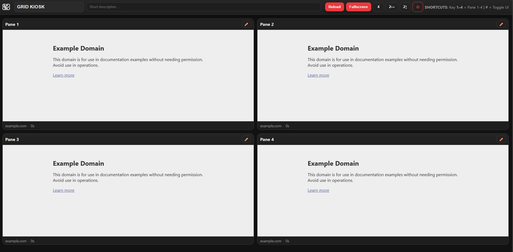
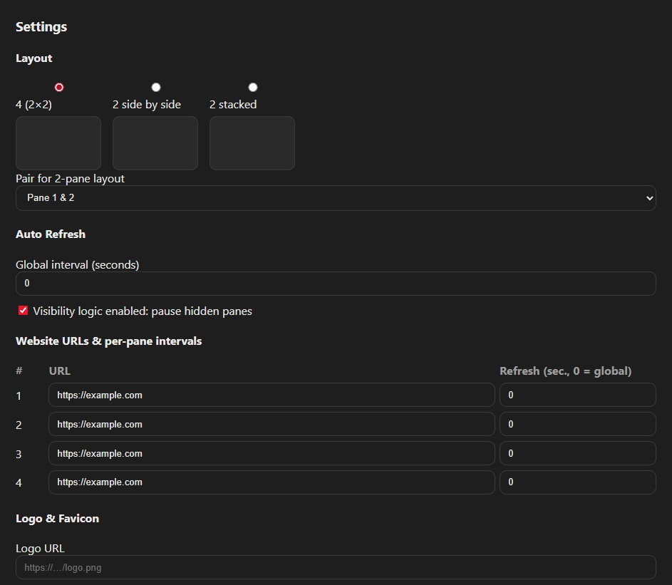
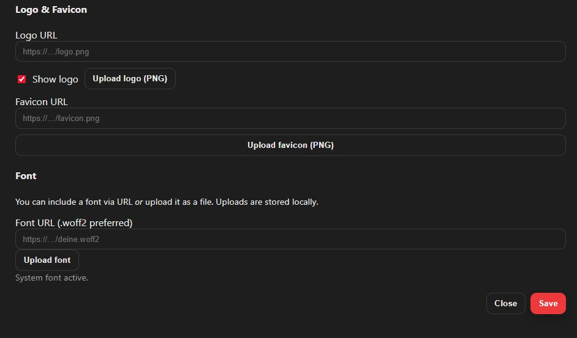
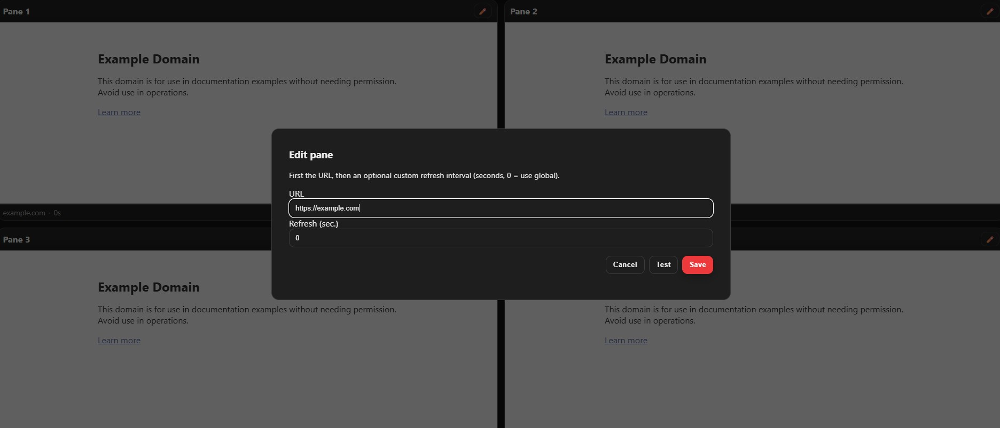

# GRID KIOSK

### GRID KIOSK is a browser-based multi-pane website dashboard for kiosk-style use. It displays up to four web pages in a configurable layout and provides quick browser-based controls for layout switching, reload behavior, branding, and persistent settings.

## Status

**Work in progress (WIP).**

## Use Case

### Designed for displaying internal tools, dashboards, status pages, documentation, or other web content in a compact kiosk-style browser interface without requiring a complex frontend stack.

## Preview

### > The preview images below assume the `README.md` is placed in the project root and the images are stored in `assets/preview/`.

## Main Features

### - Dynamic multi-pane layouts:

###   - 4 panes (2×2)

###   - 2 panes side by side

###   - 2 panes stacked vertically

###   - Pair selection for 2-pane layouts

### - Toolbar controls for:

###   - Title and subtitle

###   - Reload all panes

###   - Fullscreen toggle

###   - Layout switching

###   - Settings dialog

### - Per-pane controls:

###   - Editable website URL

###   - Custom refresh interval per pane

###   - Quick edit via pencil button

###   - Quick edit via double-click on pane title

###   - Quick edit via right-click on pane bar

### - Drag & drop URL/link support onto pane headers

### - Auto-refresh options:

###   - Global refresh interval

###   - Per-pane interval override

###   - Optional pause for hidden panes

### - Keyboard shortcuts for pane solo view and UI toggle

### - Custom branding options:

###   - Logo via URL or upload

###   - Favicon via URL or upload

###   - Custom font via URL or upload

### - Live settings reflected directly in the interface

### - Persistent state via `localStorage`

### - Optional config merge from `data/config.json`

### - Optional server-side config save via `server/save-config.php`

### - Optional asset upload handling via `server/upload.php`

### - Local/offline-friendly Material-inspired UI theme

## Supported Upload / Asset Formats

### - Logo uploads: `.png`, `.webp`, `.jpg`, `.jpeg`

### - Favicon uploads: `.png`

### - Custom font sources: `.woff2`, `.woff`, `.ttf`, `.otf`

## Requirements / Notes

### - JavaScript must be enabled.

### - The current file structure expects the main page to load `assets/css/material.css` and `assets/js/app.js`.

### - Persistent settings are stored in `localStorage`.

### - Optional upload and config-save features require server-side endpoints such as `server/upload.php` and `server/save-config.php`.

### - `data/config.json` can be used as an optional server-provided configuration source.

### - Some websites may refuse to load inside iframes because of `X-Frame-Options` or `Content-Security-Policy` restrictions.

### - Core usage works as a lightweight browser project, but upload/persistence extensions depend on a compatible local or web server setup.

### - `.woff2` is the preferred custom font format.

## Current Scope

### GRID KIOSK is focused on simple kiosk/dashboard presentation, quick layout changes, browser-based pane management, and lightweight branding. It is not intended to be a full CMS, multi-user admin platform, or remote synchronization system.

## WIP Notes

## This project is still under active development. UI labels, shortcut behavior, optional server integration, and feature scope may still change.